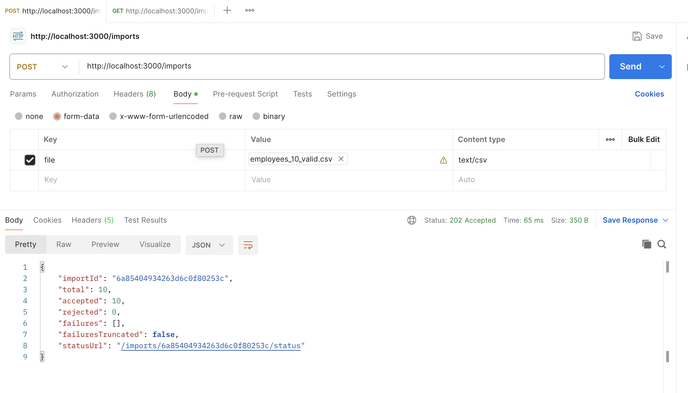
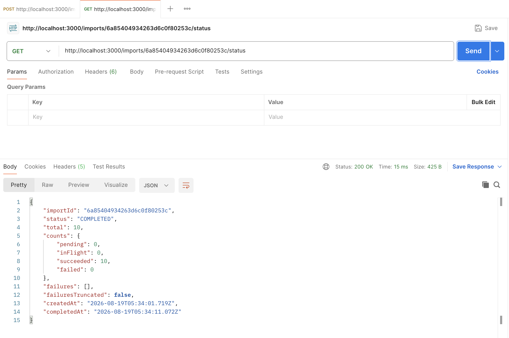

# Bulk Employee Import

Accepts a CSV of employees, validates it, and creates each one in the existing
employee service via `POST /employees`. Upload is synchronous; dispatch happens on a
cron-driven batch runner so a file with thousands of rows does not hold an HTTP
connection open.

- **Spec:** `docs/superpowers/specs/2026-08-19-bulk-employee-import-design.md`
- **Plan:** `docs/superpowers/plans/2026-08-19-bulk-employee-import.md`

## Result

- import API: 
- status API: 

## Running it

Needs MongoDB on `localhost:27017`.

```bash
npm install
npm run mock     # terminal 1 — stand-in employee service on :8888
npm start        # terminal 2 — this service on :3000
```

## Trying it

```bash
npm run gen:csv -- 200 fixtures/employees-200.csv

curl -s -X POST http://localhost:3000/imports -F file=@fixtures/employees-200.csv | jq
curl -s http://localhost:3000/imports/<importId>/status | jq
curl -s http://localhost:8888/employees | jq '.employees | length'
```

The generated file deliberately includes broken rows so a run exercises every failure
path: a bad date, a duplicate email, a missing field, a `reject` email the upstream refuses, and
`flaky` emails that make the mock return `503` twice before succeeding.

`postman/bulk-import.postman_collection.json` walks the same flow.

## API

| Route | Purpose |
|---|---|
| `POST /imports` | multipart CSV upload, returns `202` with an `importId` and any rows that failed validation |
| `GET /imports/:id/status` | live counts and accumulated failures |
| `GET /health` | liveness |

CSV columns, in this order: `name,email,start_date,country`. Dates are `DD/MM/YYYY`.

Failures report the **spreadsheet line number** — header is line 1, first employee is
line 2 — so ops can open the file and jump straight to the problem.

## How it works

```
POST /imports ──► parse ──► validate ──► dedupe ──► MongoDB (imports, import_rows)
     │ 202 + importId                                        │
     ▼                                                       ▼
GET /imports/:id/status ◄── aggregate ──   node-cron every 10s:
                                            reap → claim → dispatch → record → settle
                                                          │ pool of 5
                                                          ▼
                                            employee service POST /employees
                                            with Idempotency-Key: <email>
```

Design points worth knowing:

- **Batches are claimed atomically.** The claim `updateMany` repeats `status: 'PENDING'`
  in its filter, so two concurrent workers can never take the same row.
- **A reaper returns stale claims.** A process that dies mid-batch leaves rows wedged
  `IN_FLIGHT`; they go back to `PENDING` after `STALE_CLAIM_MS`. Safe to re-dispatch
  because every call carries an idempotency key.
- **Retries are two-layered.** The client retries 429/5xx/network three times with
  backoff inside one tick; a row that still fails returns to `PENDING` for a later tick,
  up to `MAX_ATTEMPTS`. A 4xx is terminal immediately — retrying a validation rejection
  is pointless.

## Tests

```bash
npm test
```

Vitest throughout. Store tests run against a real in-memory MongoDB
(`mongodb-memory-server`) — the atomic claim, the partial unique index, and the
stale-claim reaper are exactly the things a mocked driver would let us get wrong.

Test scope is deliberately basic: one test per behaviour that matters, plus the
concurrency guarantees. The spec lists the edge cases that would come next.

## Configuration

See `.env.example`. The dials that matter: `BATCH_SIZE` (rows per tick),
`CRON_SCHEDULE`, `UPSTREAM_CONCURRENCY`, `MAX_ATTEMPTS`.
